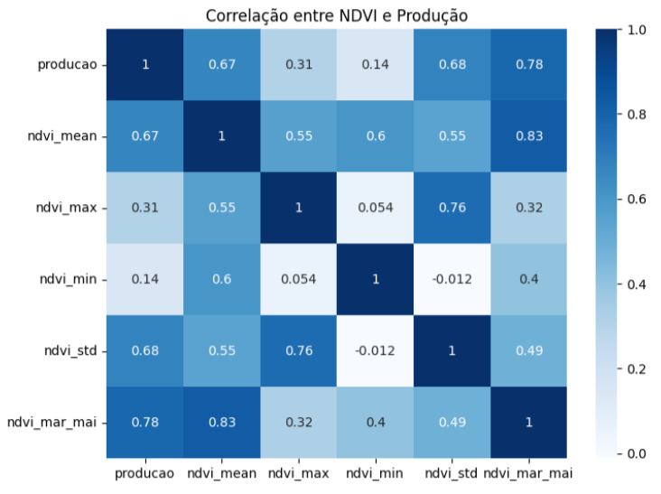
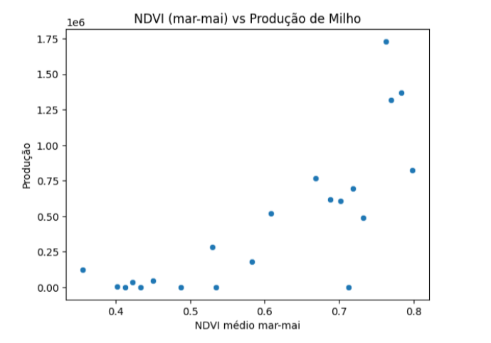
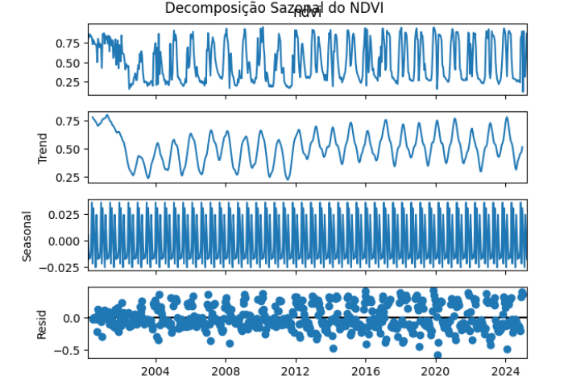
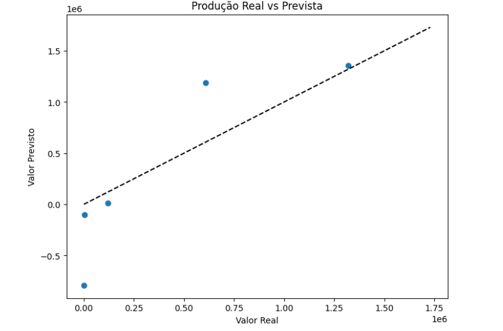

# 📊 Projeto de Previsão de Produtividade Agrícola com NDVI

Este projeto tem como objetivo prever a produtividade agrícola (milho) utilizando dados históricos de produção e NDVI (Índice de Vegetação por Diferença Normalizada), com foco em análise estatística, identificação de padrões sazonais e aplicação de modelos preditivos de Machine Learning.

---

## 🔍 1. Preparação e Tratamento dos Dados

Os datasets utilizados foram:

- **milho_producao.csv**: contém os dados anuais de produção de milho (em toneladas). https://sidra.ibge.gov.br/tabela/839
- **ndvi_data.csv**: contém valores de NDVI extraídos de imagens de satélite, com registros por data. https://www.satveg.cnptia.embrapa.br/

### Etapas realizadas:
- Conversão de colunas de data e ano para o formato correto.
- Geração de novas colunas: `ano` e `mês` a partir da data.
- Remoção de valores nulos e outliers extremos usando Z-Score.
- Agregação do NDVI por ano e cálculo de estatísticas:
  - NDVI médio (`ndvi_mean`)
  - NDVI máximo (`ndvi_max`)
  - NDVI mínimo (`ndvi_min`)
  - Desvio padrão (`ndvi_std`)
  - NDVI médio no período crítico (março a maio) → `ndvi_mar_mai`

---

## 🧠 2. Justificativa das Variáveis Selecionadas

| Variável          | Justificativa |
|-------------------|---------------|
| `ndvi_mean`       | Representa a saúde geral da vegetação ao longo do ano. |
| `ndvi_max`        | Indica o pico de vigor da cultura em algum momento do ciclo. |
| `ndvi_min`        | Pode sinalizar estresse hídrico ou falhas na lavoura. |
| `ndvi_std`        | Mede a variabilidade da cobertura vegetal no ano. |
| `ndvi_mar_mai`    | Corresponde ao período crítico de crescimento do milho, onde o NDVI tende a refletir diretamente a produtividade final. |

Essas variáveis foram escolhidas com base em conhecimento agronômico e correlações estatísticas observadas nas análises exploratórias.

---

## ⚙️ 3. Escolha e Justificativa do Modelo

### Modelo escolhido: `Lasso Regression`

**Por que Lasso?**

- Foi o modelo com **melhor desempenho inicial (menor RMSE e maior R²)** entre os testados.
- Possui capacidade de **selecionar automaticamente as variáveis mais relevantes**, reduzindo o risco de overfitting.
- Ideal para cenários com poucas variáveis e datasets limitados.

### Comparação de Modelos Iniciais:

| Modelo               | RMSE     | R² Score |
|----------------------|----------|----------|
| Lasso Regression     | 476.615  | 0.114    |
| Linear Regression    | 476.619  | 0.114    |
| Ridge Regression     | 493.070  | 0.052    |
| Random Forest        | 589.011  | -0.353   |
| Gradient Boosting    | 774.638  | -1.340   |
| Decision Tree        | 775.338  | -1.344   |

---

## 🔁 4. Melhorias Pós-Escolha do Modelo

Após a seleção do modelo **Lasso Regression**, foram realizados aprimoramentos no pipeline:

- Criação de novas variáveis derivadas de NDVI (sazonais e estatísticas).
- Foco no NDVI durante o **período crítico da cultura (março a maio)**.
- Validação cruzada 5-fold para avaliação mais robusta.
- Limpeza avançada de outliers e dados ruidosos.

### ✅ **Resultados Após Melhorias:**

| Métrica                           | Valor        |
|-----------------------------------|--------------|
| RMSE (após melhorias)             | **443.445**  |
| R² Score (após melhorias)         | **0.23**     |
| R² Cross-Validation (5-fold)      | ~-70185.391* |

> *Nota: o valor extremo negativo da validação cruzada pode indicar overfitting em folds com muito poucos dados ou dados mal distribuídos.*

---

## 📈 5. Análises Exploratórias e Estatísticas

### Correlação entre variáveis:

### Dispersão NDVI (mar-mai) x Produção:

### Decomposição Sazonal do NDVI:

---

## ✅ 6. Métricas Finais e Avaliação Visual

| Métrica | Resultado |
|---------|-----------|
| RMSE    | ~443.445  |
| R²      | 0.23      |

### Gráfico de Previsão x Real:

---

## 📌 Conclusão
## 📌 Conclusão

O modelo baseado em `Lasso Regression` obteve os melhores resultados ao prever a produção de milho utilizando dados derivados de NDVI, especialmente com foco no período crítico da cultura. As variáveis sazonais e estatísticas agregadas melhoraram significativamente a performance inicial.

No entanto, foi identificado um problema estrutural que limita o potencial do modelo: os dados de **produção agrícola estão disponíveis apenas em nível municipal**, enquanto os dados de **NDVI são obtidos em nível de talhão (área de cultivo específica)**. Essa diferença de granularidade dificulta o alinhamento preciso entre vegetação e produtividade real.

Além disso, a plataforma da Embrapa utilizada para coleta dos dados NDVI impõe **limites na quantidade de talhões que podem ser selecionados por vez**, o que torna inviável mapear todas as fazendas de milho de uma cidade. Também há a ausência de uma base pública que relacione **quais e onde estão todas as áreas produtoras de milho em cada município**.

Para uma modelagem mais precisa e representativa, seria necessário focar em um **território específico** (ex: uma única fazenda ou distrito rural bem delimitado), onde seja possível:
- Selecionar **todos os talhões** da área com precisão.
- Obter o **histórico completo da produção local** ao longo dos anos.

Com dados integrados e consistentes entre vegetação e produtividade, o desempenho preditivo do modelo pode ser significativamente melhorado.

---
